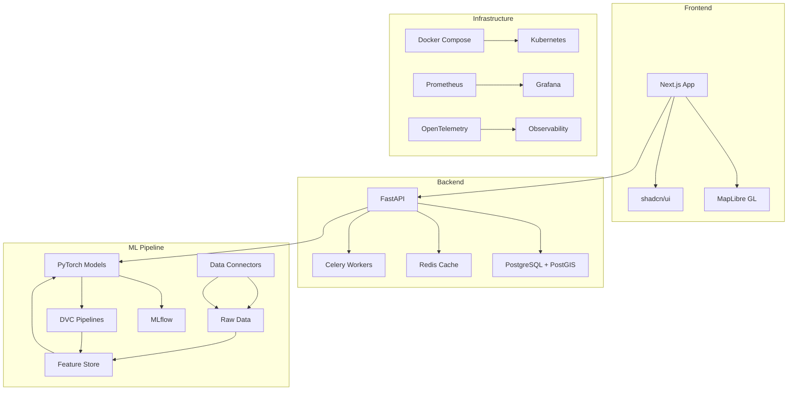

# Climate Risk Lens

A production-grade geospatial platform for forecasting local climate hazards and converting them into actionable briefs for cities, businesses, and communities.

## Quick Start

```bash
# Clone and setup
git clone <repo-url>
cd climate-risk-platform
cp .env.example .env
make setup

# Start development environment
make dev

# Access the application
open http://localhost:3000
```

## Architecture



## Environment Variables

See `.env.example` for required configuration:

- `POSTGRES_*`: Database connection settings
- `REDIS_URL`: Redis cache and Celery broker
- `MINIO_*`: Object storage for artifacts
- `MLFLOW_*`: MLflow tracking server
- `OPENAI_API_KEY`: OpenAI API for brief generation
- `ANTHROPIC_API_KEY`: Anthropic API for brief generation
- `AIRNOW_API_KEY`: EPA AirNow air quality data
- `PURPLEAIR_API_KEY`: PurpleAir sensor data
- `NOAA_TOKEN`: NOAA weather data
- `MAPTILES_URL`: Map tile server endpoint
- `JWT_SECRET`: JWT signing secret
- `CORS_ORIGINS`: Allowed CORS origins

## ASCII-Only Policy

This project enforces strict ASCII-only text throughout:

- No emojis, em dashes, en dashes, or smart quotes
- All user-facing text, logs, and generated content must be ASCII
- Automated checks via pre-commit hooks and CI
- Sanitization middleware in backend and frontend

## Development Commands

```bash
make dev          # Start full development stack
make test         # Run all tests
make lint         # Lint code
make format       # Format code
make train        # Train ML models
make dvc-pull     # Pull data with DVC
make seed         # Seed demo data
make tiles        # Build map tiles
make k8s-deploy   # Deploy to Kubernetes
```

## Troubleshooting

### Common Issues

1. **Database connection errors**: Ensure PostgreSQL with PostGIS extension is running
2. **Redis connection issues**: Check Redis server status and connection string
3. **MLflow tracking errors**: Verify MLflow server is accessible
4. **Map tiles not loading**: Check tile server configuration and network access

### Logs

```bash
# View all services
docker-compose logs -f

# View specific service
docker-compose logs -f backend
docker-compose logs -f frontend
```

## API Documentation

See `/docs/API.md` for complete API reference.

## Contributing

1. Follow ASCII-only policy strictly
2. Run pre-commit hooks before committing
3. Ensure tests pass with 90%+ coverage
4. Update documentation for new features

## License

See LICENSE file for details.