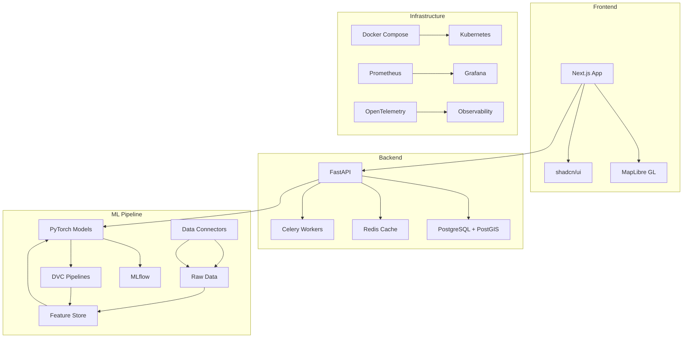

# Climate Risk Lens

A production-grade geospatial platform for forecasting local climate hazards and converting them into actionable briefs for cities, businesses, and communities.

## Prerequisites

Before you begin, ensure you have the following installed on your system:

### Required Software
- **Docker** (version 20.10 or later) - [Download Docker](https://www.docker.com/products/docker-desktop/)
- **Docker Compose** (version 2.0 or later) - Usually included with Docker Desktop
- **Git** - [Download Git](https://git-scm.com/downloads)
- **Make** - Usually pre-installed on macOS/Linux. For Windows, install via [Chocolatey](https://chocolatey.org/) or [WSL](https://docs.microsoft.com/en-us/windows/wsl/)

### Optional Software (for development)
- **Python 3.11+** - [Download Python](https://www.python.org/downloads/)
- **Node.js 18+** - [Download Node.js](https://nodejs.org/)
- **npm** - Usually included with Node.js

### System Requirements
- **RAM**: Minimum 8GB, Recommended 16GB
- **Storage**: At least 10GB free space
- **CPU**: Multi-core processor recommended

## Quick Start

### Option 1: Automated Setup (Recommended)
We provide setup scripts that handle everything automatically:

**For Linux/macOS:**
```bash
git clone <repo-url>
cd climate-risk-platform
./setup.sh
```

**For Windows:**
```cmd
git clone <repo-url>
cd climate-risk-platform
setup.bat
```

The setup script will:
- Check all requirements
- Set up the environment
- Install dependencies
- Start all services
- Show you the access URLs

### Option 2: Manual Setup
If you prefer to set up manually:

#### 1. Clone the Repository
```bash
git clone <repo-url>
cd climate-risk-platform
```

#### 2. Set Up Environment
```bash
# Copy the environment template
cp .env.example .env

# Edit the .env file if needed (optional for basic setup)
# The default values will work for local development
```

#### 3. Install Dependencies and Start Services
```bash
# Install all dependencies and start the development environment
make setup
make dev
```

#### 4. Access the Application
Once all services are running, you can access:

- **Main Application**: http://localhost:3000
- **API Documentation**: http://localhost:8000/docs
- **MLflow (ML Tracking)**: http://localhost:5000
- **Grafana (Monitoring)**: http://localhost:3001 (admin/admin)
- **MinIO (File Storage)**: http://localhost:9001 (minioadmin/minioadmin)

#### 5. Verify Installation
Open your web browser and navigate to http://localhost:3000. You should see the Climate Risk Lens application with an interactive map.

## What to Expect

### First Launch
When you first open the application, you'll see:

1. **Interactive Map**: A full-screen map showing your current location or a default location
2. **Control Panel**: On the left side, you'll find controls for:
   - Layer toggles (Flood, Heat, Smoke, PM2.5, Uncertainty)
   - Time horizon slider (1-72 hours)
   - Risk visualization options
3. **Risk Data**: The map will display color-coded risk areas based on the selected layers
4. **Navigation**: You can pan, zoom, and explore different areas on the map

### Demo Data
The application comes with demo data that includes:
- Sample risk predictions for different climate hazards
- Historical weather data
- Simulated sensor readings
- Pre-computed risk assessments

### Features Available
- **Real-time Risk Visualization**: See current and predicted climate risks
- **Multiple Hazard Types**: Flood, heat, smoke, and air quality risks
- **Time-based Predictions**: View risk forecasts up to 72 hours ahead
- **Interactive Controls**: Toggle different data layers and adjust time horizons
- **Responsive Design**: Works on desktop and mobile devices

### Getting Started with the Map
1. **Explore the Map**: Use mouse/touch to pan and zoom
2. **Toggle Layers**: Click the checkboxes to show/hide different risk types
3. **Adjust Time**: Use the slider to see predictions for different time periods
4. **View Details**: Click on areas of the map to see detailed risk information
5. **Change Location**: Search for different cities or regions

## Alternative Setup Methods

### Docker-Only Setup (Recommended for beginners)
If you prefer to use only Docker without installing Python/Node.js locally:

```bash
# Clone and setup
git clone <repo-url>
cd climate-risk-platform
cp .env.example .env

# Start all services with Docker
docker-compose up -d

# Wait for services to be ready (about 2-3 minutes)
# Then access the application at http://localhost:3000
```

### Manual Setup (For developers)
If you want to run services locally without Docker:

```bash
# 1. Start infrastructure services only
docker-compose up -d postgres redis mlflow minio

# 2. Install Python dependencies
cd backend
pip install -e .

# 3. Install Node.js dependencies
cd ../frontend
npm install

# 4. Start backend
cd ../backend
uvicorn app.main:app --reload --host 0.0.0.0 --port 8000

# 5. Start frontend (in a new terminal)
cd frontend
npm run dev

# 6. Start Celery worker (in another terminal)
cd backend
celery -A app.workers.celery worker --loglevel=info
```

## Architecture



## Configuration

### Environment Variables

The application uses environment variables for configuration. A template file `.env.example` is provided with default values that work for local development.

**Important**: Copy `.env.example` to `.env` before starting the application:
```bash
cp .env.example .env
```

### Key Configuration Options

#### Required for Basic Operation
- `POSTGRES_*`: Database connection settings (defaults work for Docker setup)
- `REDIS_URL`: Redis cache and task queue (defaults work for Docker setup)
- `JWT_SECRET`: Security key for authentication (change in production)

#### Optional API Keys (for enhanced features)
- `OPENAI_API_KEY`: OpenAI API for AI-powered brief generation
- `ANTHROPIC_API_KEY`: Anthropic API for AI-powered brief generation
- `AIRNOW_API_KEY`: EPA AirNow air quality data
- `PURPLEAIR_API_KEY`: PurpleAir sensor data
- `NOAA_TOKEN`: NOAA weather data

#### Advanced Configuration
- `MINIO_*`: Object storage settings (defaults work for Docker setup)
- `MLFLOW_*`: MLflow tracking server settings (defaults work for Docker setup)
- `MAPTILES_URL`: Map tile server endpoint
- `CORS_ORIGINS`: Allowed CORS origins for API access

**Note**: For local development, you can use the default values without any API keys. The application will work with demo data and limited functionality.

## ASCII-Only Policy

This project enforces strict ASCII-only text throughout:

- No emojis, em dashes, en dashes, or smart quotes
- All user-facing text, logs, and generated content must be ASCII
- Automated checks via pre-commit hooks and CI
- Sanitization middleware in backend and frontend

## Managing the Application

### Starting the Application
```bash
# Start all services
make dev

# Or start with Docker only
docker-compose up -d
```

### Stopping the Application
```bash
# Stop all services
make stop

# Or stop with Docker
docker-compose down
```

### Restarting Services
```bash
# Restart all services
make stop
make dev

# Or restart specific service
docker-compose restart [service-name]
```

### Viewing Logs
```bash
# View all service logs
docker-compose logs -f

# View specific service logs
docker-compose logs -f frontend
docker-compose logs -f backend
docker-compose logs -f postgres
```

### Checking Service Status
```bash
# Check which services are running
docker-compose ps

# Check resource usage
docker stats
```

## Development Commands

```bash
make dev          # Start full development stack
make stop         # Stop all development services
make test         # Run all tests
make lint         # Lint code
make format       # Format code
make train        # Train ML models
make dvc-pull     # Pull data with DVC
make seed         # Seed demo data
make tiles        # Build map tiles
make k8s-deploy   # Deploy to Kubernetes
make clean        # Clean up temporary files
```

## Troubleshooting

### Common Issues and Solutions

#### 1. Services Won't Start
**Problem**: Docker services fail to start or show errors.

**Solutions**:
```bash
# Check if Docker is running
docker --version
docker-compose --version

# Check available disk space
df -h

# Restart Docker services
docker-compose down
docker-compose up -d

# Check service status
docker-compose ps
```

#### 2. Application Not Loading
**Problem**: Browser shows "This site can't be reached" or similar errors.

**Solutions**:
```bash
# Check if all services are running
docker-compose ps

# Check service logs
docker-compose logs frontend
docker-compose logs backend

# Verify ports are not in use
netstat -tulpn | grep :3000
netstat -tulpn | grep :8000
```

#### 3. Database Connection Errors
**Problem**: Backend shows database connection errors.

**Solutions**:
```bash
# Check PostgreSQL status
docker-compose ps postgres

# Check PostgreSQL logs
docker-compose logs postgres

# Restart PostgreSQL
docker-compose restart postgres

# Wait for database to be ready
sleep 30
```

#### 4. Map Not Displaying
**Problem**: Map appears blank or shows loading errors.

**Solutions**:
```bash
# Check tile server status
docker-compose ps tileserver

# Check tile server logs
docker-compose logs tileserver

# Verify map tiles are available
curl http://localhost:8080/health
```

#### 5. API Errors
**Problem**: Frontend shows API errors or 500 status codes.

**Solutions**:
```bash
# Check backend status
docker-compose ps backend

# Check backend logs
docker-compose logs backend

# Test API directly
curl http://localhost:8000/api/v1/healthz
```

#### 6. Out of Memory Errors
**Problem**: Services crash with memory errors.

**Solutions**:
```bash
# Check system memory
free -h

# Check Docker memory usage
docker stats

# Increase Docker memory limit in Docker Desktop settings
# Or reduce the number of services running
```

### Getting Help

#### Check Service Logs
```bash
# View all service logs
docker-compose logs -f

# View specific service logs
docker-compose logs -f [service-name]

# View last 100 lines of logs
docker-compose logs --tail=100 [service-name]
```

#### Check Service Status
```bash
# List all services and their status
docker-compose ps

# Check resource usage
docker stats

# Check service health
curl http://localhost:8000/api/v1/healthz
curl http://localhost:3000
```

#### Reset Everything
If you're having persistent issues, you can reset the entire environment:

```bash
# Stop all services
docker-compose down

# Remove all containers and volumes
docker-compose down -v
docker system prune -a

# Start fresh
make setup
make dev
```

### Performance Issues

#### Slow Loading
- Ensure you have at least 8GB RAM available
- Close other resource-intensive applications
- Check if antivirus software is scanning Docker files

#### High CPU Usage
- Check if all services are running: `docker-compose ps`
- Monitor resource usage: `docker stats`
- Consider running fewer services for development

### Platform-Specific Issues

#### Windows
- Ensure WSL2 is enabled if using Docker Desktop
- Check Windows Defender exclusions for Docker
- Verify Hyper-V is enabled

#### macOS
- Ensure Docker Desktop has sufficient memory allocated
- Check if antivirus software is interfering
- Verify file sharing permissions

#### Linux
- Ensure Docker daemon is running: `sudo systemctl status docker`
- Check user permissions for Docker: `sudo usermod -aG docker $USER`
- Verify sufficient disk space: `df -h`

## API Documentation

See `/docs/API.md` for complete API reference.

## Quick Reference

### Essential URLs
- **Application**: http://localhost:3000
- **API Docs**: http://localhost:8000/docs
- **MLflow**: http://localhost:5000
- **Grafana**: http://localhost:3001 (admin/admin)
- **MinIO**: http://localhost:9001 (minioadmin/minioadmin)

### Essential Commands
```bash
# Quick start (automated)
./setup.sh          # Linux/macOS
setup.bat           # Windows

# Quick start (manual)
cp .env.example .env
make setup
make dev

# Check status
docker-compose ps

# View logs
docker-compose logs -f

# Stop everything
make stop
```

### Default Credentials
- **Grafana**: admin/admin
- **MinIO**: minioadmin/minioadmin
- **PostgreSQL**: postgres/postgres
- **Redis**: No authentication required

### Ports Used
- 3000: Frontend application
- 8000: Backend API
- 5000: MLflow tracking
- 3001: Grafana monitoring
- 9000: MinIO API
- 9001: MinIO console
- 5432: PostgreSQL database
- 6379: Redis cache
- 8080: Map tile server
- 9090: Prometheus metrics

## Contributing

1. Follow ASCII-only policy strictly
2. Run pre-commit hooks before committing
3. Ensure tests pass with 90%+ coverage
4. Update documentation for new features

## License

See LICENSE file for details.